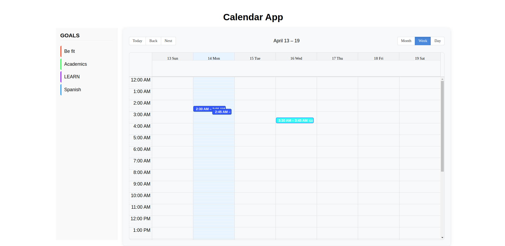

React Calendar Application
A full-stack calendar application built with React.js, Redux, and MongoDB that provides a Google Calendar-like experience with task management capabilities.
Project Overview
This application allows users to create and manage calendar events with an intuitive drag-and-drop interface. The application integrates goal tracking and task management directly with the calendar view.
 
Features

Interactive Calendar Interface

Week, month, and day views
Drag-and-drop event management
Color-coded events by category

Event Management

Create, view, edit, and delete events
Events can be as short as 15 minutes
Expand and contract events to adjust duration
Move events across the calendar

Task & Goal Integration

Two lists fetched from the database (Goals and Tasks)
Color-coded task categories
Drag tasks directly to calendar to create events
Tasks inherit the color of their parent goal

Data Persistence

All events stored in MongoDB
State management with Redux
Full CRUD operations via RESTful API

Tech Stack

Frontend:

React.js
Redux for state management
CSS for styling

Backend:

Node.js
Express.js
MongoDB for data storage
RESTful API (POST, GET, PUT endpoints)

